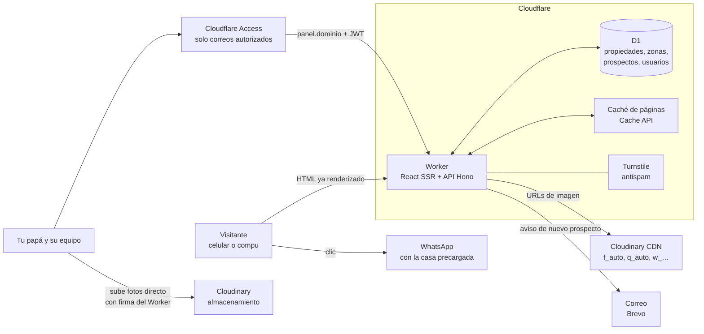

# Análisis del sitio actual · Activos Inmobiliarios Globales

- **Sitio analizado:** https://activosinmobiliariosglobales.com/
- **Fecha:** 16 de septiembre de 2026
- **Método:** solo lectura. Se recorrieron las 14 páginas publicadas, las 188 fichas de propiedad, la API pública de WordPress, el sitemap y las cabeceras del servidor. También se midió la velocidad con Lighthouse 12 y se tomaron capturas en computadora y celular. No se mandó ningún formulario ni se intentó entrar a ninguna cuenta.
- **Para qué sirve este documento:** saber qué hace hoy el sitio, qué está mal y qué hay que construir en el sitio nuevo con **React**, un **Worker de Cloudflare** y **Cloudinary** para las fotos.
- **Material de respaldo:** todo lo descargado está en `analisis/crudo/` y las capturas en `analisis/capturas/` (ver el anexo al final).

---

## 0. Resumen en diez líneas

1. El sitio es un **WordPress con Elementor Pro y unos 15 complementos de pago** (familia Jet, Ultimate Addons, Astra Pro). Lo armó *MARC Consultores Web* sobre una **plantilla inmobiliaria en inglés («Findero»)** que nunca se terminó de limpiar.
2. Su corazón es un **catálogo de 188 propiedades** (casi todas casas en venta en Morelia) con filtros, listado, ficha y galería. Todo lo demás es informativo: servicios, acerca y contacto.
3. **En celular es muy lento:** la portada tarda **~17 s en mostrar algo** y **~23 s en cargar la imagen principal** (Lighthouse móvil, calificación **27/100**). Descarga casi **8 MB** en 101 archivos, 54 de ellos scripts.
4. **El filtro de precio no sirve:** el deslizador solo llega a $1,000,000, y **181 de las 188 propiedades (96 %)** cuestan más. La mediana es $4.2 M.
5. **Hay contenido falso de la plantilla a la vista del público:** testimonios *Lorem ipsum* de «James Oliver» en la portada, una página de preguntas frecuentes en latín, un contacto en San Francisco, un login que dice «User: demo / Password: demo» y una página de agentes que muestra el usuario «admin». Además, casi todas están en el sitemap que lee Google.
6. **Los datos de cada casa están desordenados:** el precio, las recámaras y los m² viven en campos que la API no entrega, las descripciones se pegan tal cual de Facebook (46 con letras «negritas» Unicode como 𝗖𝗔𝗦𝗔, que Google y los lectores de pantalla no leen como texto normal), 60 fichas no tienen m² de terreno y 27 comparten título con otra casa.
7. **El contacto está partido:** hay dos direcciones distintas (pie de página y página de contacto), el botón «Informes» de cada casa manda al formulario genérico sin decir qué casa interesa, y el WhatsApp tampoco lleva el nombre de la propiedad.
8. **Las fotos son las que se mandan por WhatsApp** (de ~130 KB y unos 1,200 px, ya comprimidas por WhatsApp, con nombres tipo `WhatsApp-Image-2026-09-10-at-4.14.10-PM-1.jpeg`). La biblioteca tiene **8,430 archivos**.
9. **El dominio, el hosting y el correo `info@` viven en el mismo servidor** (HostDime, `dizinc.com`). Al mudar el sitio **hay que cuidar el correo** o deja de llegar.
10. **Recomendación:** React con render en servidor dentro de un Worker, **D1 como base de datos** de propiedades, contenido y prospectos, y **Cloudinary para fotos y videos**. Además, un **panel privado** (`panel.` + Cloudflare Access, invisible para el público) donde tu papá y su equipo suben y modifican casas, fotos, textos, datos de contacto y prospectos, cada uno con su rol (§11.8).

---

## 1. El negocio, según el propio sitio

| Dato | Lo que dice el sitio |
|---|---|
| Nombre | Activos Inmobiliarios Globales |
| Lema | «Donde cada propiedad cuenta una historia» |
| Qué hace | Comercialización, renta y financiamiento de inmuebles |
| Fundación | 1 de diciembre de 2024, Michoacán |
| Servicios (6) | Venta de inmuebles · Renta de inmuebles · Financiamientos inmobiliarios · Trámites inmobiliarios (verificación de documentos, contratos, créditos hipotecarios, avalúos certificados) · Asesoría personalizada · Promoción y marketing inmobiliario |
| Valores | Responsabilidad, Honestidad, Pasión, Calidad |
| Misión y visión | **Tienen exactamente el mismo texto** (error de contenido) |
| Teléfono fijo | 443 298 3138 (solo aparece en Contacto) |
| Celular / WhatsApp | 443 492 2197 (sale dos veces seguidas en el pie de página) |
| Correo | info@activosinmobiliariosglobales.com |
| Dirección en el pie de página | Periférico Sector Nueva España 6338, int. 17, Lázaro Cárdenas, 58229 Morelia (con enlace a Apple Maps) |
| Dirección en la página Contacto | Batalla de Casa Mata #799, int. 9, Chapultepec Sur, Morelia (con mapa de Google incrustado) |
| Redes | Facebook (`profile.php?id=61569927005730`, sin nombre de usuario propio) e Instagram (`@activosinmobiliariosglobales`) |
| Crédito del pie | «Sitio Creado por MARC Consultores Web ® 2025» |

> **Pregunta para tu papá:** ¿cuál de las dos direcciones es la buena? La nueva web debe tener **una sola**, igual en todos lados y en Google Maps.

---

## 2. Con qué está hecho hoy

| Capa | Hoy |
|---|---|
| CMS | WordPress 7.1 |
| Tema | Astra + Astra Pro (addon) |
| Constructor visual | Elementor 4.2.4 + Elementor Pro + Ultimate Addons for Elementor |
| Catálogo inmobiliario | **JetEngine** (tipo de contenido `properties` con campos propios) |
| Filtros | JetSmartFilters (desplegables, rango de precio, casillas, orden, paginación) |
| Otros complementos Jet | JetPopup, JetTabs, JetReviews, JetElements, JetBlocks, JetTricks, JetThemeCore, JetFormBuilder |
| Formularios | Contact Form 7 (los que sí se usan) + JetFormBuilder (los de la plantilla) |
| Antispam | Google reCAPTCHA (el sello flotante tapa contenido en celular) |
| SEO | Yoast SEO (sitemap, datos de Open Graph) |
| Otros | LoginPress, Duplicate Post |
| Analítica | Google Analytics 4 · `G-R1K372MV0S`. **No hay píxel de Facebook** |
| Servidor | Apache compartido, IP `201.131.125.10` |
| Dominio | Registrado en **Neubox** el 06/12/2024 · **vence el 06/12/2026** (consulta RDAP del 16/09/2026) |
| DNS | `dns32532.dizinc.com` y `dns32533.dizinc.com` (HostDime México; la IP pertenece a HostDime.com.mx S.A. de C.V.). El registro en Neubox delega en `dns31884/31885.dizinc.com` (también HostDime; suele ser normal) |
| Correo | El registro MX apunta **al mismo servidor** del sitio |
| HTTPS | Sí. `http://` y `www.` redirigen bien (301) al dominio sin www |

**Qué significa:** cada uno de estos complementos es una licencia que alguien paga y actualiza. Si alguno se vence o se rompe con una actualización, el catálogo deja de funcionar. El sitio nuevo no necesita ninguno.

---

## 3. Mapa del sitio: lo real y lo que sobró de la plantilla

### 3.1 Páginas reales (las del menú)

| Ruta | Qué es | Estado |
|---|---|---|
| `/` | Portada | Funciona, pero con testimonios falsos y textos en inglés |
| `/acerca/` | Historia, misión, visión y valores | Misión = visión |
| `/servicios/` | Los 6 servicios | Bien, solo texto |
| `/properties/` | **Listado real con filtros** (título «Properties archivo») | Funciona; filtro de precio roto |
| `/propiedades/` | Otra página de listado, con filtros más simples y la descripción completa en cada tarjeta | **Duplica** a `/properties/` |
| `/properties/<slug>/` | Ficha de cada propiedad | Funciona |
| `/property-type/<tipo>/` y las otras taxonomías | Listados por tipo, ubicación, propósito y tipo de vivienda | Funcionan y están en el sitemap |
| `/contacto/` | Datos, formulario y mapa | Funciona, pero con otra dirección |

### 3.2 Restos de la plantilla «Findero» publicados (y en el sitemap)

| Ruta | Qué muestra al público | Riesgo |
|---|---|---|
| `/home/` | Portada vieja en inglés: «Find the Best Property for Rent or Sale» | Contenido duplicado en Google |
| `/faq/` | «How do I create an account at **Findero.me**?» + *Lorem ipsum* | Imagen poco seria |
| `/contact-us/` | «50 Valencia Street, San Francisco», `hello@findero.me`, `+1 800 4439 975` y un formulario de contacto activo (no se probó) | Contactos que se pierden o confunden |
| `/inicio-sesion/` | «Try the account in action! **User: demo Password: demo**» y un formulario de login activo (no se probó) | Invita a probar credenciales |
| `/registration/` | Registro de cuentas con contraseña y un texto de términos con el HTML roto (`u003ca href=u0022#u0022`) | Cuentas basura en el WordPress |
| `/agents/` | «Trusted Real Estate Agents» mostrando **«infousr · Administrador · admin»** | Expone nombres de usuario |
| `/single-agent/` | Página vacía | — |
| `/map-listing/` | Mapa de Google con filtros (853 KB de HTML) | Es la única página con mapa, y nadie llega a ella |
| `/account/` | Responde 404 **pero está en el sitemap** | Error de rastreo en Google |

**En el sitio nuevo:** nada de esto existe. Las rutas viejas se redirigen (301) a su equivalente real o a la portada.

---

## 4. Funciones una por una

Cada fila dice cómo funciona hoy, qué falla y qué debe hacer la versión nueva.

| # | Función | Hoy | Problemas detectados | En el sitio nuevo |
|---|---|---|---|---|
| F1 | **Portada** | Imagen de fondo a pantalla completa, subtítulo animado letra por letra, botón «Comenzar a Buscar», 6 servicios, 9 «Propiedades Recomendadas», contadores por tipo, filtros, testimonios, «¿Quiénes somos?» y formulario «Agenda tu Cita» | La foto principal es una imagen genérica de catálogo, no una propiedad del inventario. El subtítulo animado **se corta en celular** («…MOBILIARIOS GLOB ALES»). Testimonios *Lorem ipsum*. Títulos en inglés. «Recomendadas» son simplemente las 9 más recientes | Buscador protagonista arriba (operación, zona, tipo, precio), destacadas elegidas a mano desde el panel, confianza real (casas vendidas, reseñas reales de Google) y llamada a WhatsApp |
| F2 | **Buscador y filtros** | Propósito, Ubicación, Tipo de propiedad, Recámaras («Bedrooms Any»), Rango de precio, 30 amenidades en casillas, Tipo de vivienda y orden (precio, fecha, «año») | **Rango de precio tope $1,000,000** cuando casi todo cuesta más. Mezcla de español e inglés («Filter Results», «Bedrooms Any», «More»). Erratas: «Caulquiera», «Cerrardo». Letra cirílica escondida en «Сondition». Ordenar por «año» sin dato de año. Las amenidades casi no están capturadas (ver §5.4) | Filtros en la URL (`?operacion=venta&zona=morelia&precio_max=3000000`) para que se puedan compartir y los lea Google. El rango de precio se calcula solo con los datos reales. Contador en vivo («38 casas») |
| F3 | **Listado** | Cuadrícula de tarjetas: foto, título, precio, cuartos, baños, m²; paginación de 10 en 10 | Muchos títulos idénticos («Casa en El Prado» ×4). Los m² de la tarjeta (construcción) no coinciden con los de la ficha (terreno). Hay **dos** listados distintos (`/properties/` y `/propiedades/`) | Un solo listado, con vista de lista y de mapa. Tarjeta con zona, operación, precio, recámaras, baños, m² de construcción **y** de terreno |
| F4 | **Ficha de propiedad** | Foto principal enorme (ocupa toda la pantalla), franja roja con precio, habitaciones, baños y m², botón «Informes», bloque «Especificaciones», «Description», «Galería», tarjeta de contacto («Connect with us:») y «Propiedades Similares» | «Informes» lleva a `/contacto/` genérico: **no se sabe qué casa interesa**. Etiquetas en inglés. «Property ID: 12486» es el número interno de WordPress. **No hay mapa** ni ubicación aproximada. La foto principal lleva la marca de agua encima | Galería táctil a pantalla completa, precio y datos clave arriba, **formulario y WhatsApp que ya incluyen el nombre y la clave de la casa**, mapa de zona aproximada, calculadora de crédito, botón de compartir y ficha imprimible en PDF |
| F5 | **Galería** | Lightbox/Swiper con las fotos subidas (16–17 por ficha en las recientes) | Fotos comprimidas por WhatsApp, sin textos alternativos (16 de 22 imágenes sin `alt` en la ficha revisada) | Cloudinary entrega cada foto al tamaño exacto y en AVIF o WebP. Orden de fotos editable y portada elegida desde el panel |
| F6 | **Propiedades similares** | Cuadrícula al final de la ficha | Criterio desconocido | Misma zona y tipo, precio ±25 % |
| F7 | **Formulario de contacto** | Contact Form 7: nombre, correo, ciudad, teléfono y mensaje (en Contacto) · nombre, correo y mensaje («Agenda tu Cita», en la portada) | «Agenda tu Cita» **no agenda nada** y ni siquiera pide teléfono. No se sabe adónde llegan los mensajes ni si alguien los contesta | Un solo formulario con tres versiones (general, por propiedad y «quiero vender o rentar mi casa»). Se guarda en D1, avisa por correo o WhatsApp y se consulta en el panel |
| F8 | **Botón flotante de WhatsApp** | Icono verde fijo a la derecha, al 443 492 2197, con mensaje prellenado | **Tapa texto y precios en celular**. Hay dos mensajes distintos, y uno habla de «productos». No sabe desde qué casa se pulsó | En la ficha, el mensaje dice «Hola, me interesa *Casa en El Prado (AIG-0123)*: <enlace>». Se registra el clic para saber qué casas generan interés |
| F9 | **Buscador de texto** | Lupa en el encabezado y en el pie (búsqueda nativa de WordPress, en inglés: «Search…») | Busca en textos con letras Unicode raras | Buscar por colonia o fraccionamiento dentro del mismo filtro |
| F10 | **Ventana emergente** | JetPopup «Send Message to Seller» (en inglés) | Plantilla sin traducir, no se detectó dónde se abre | Se elimina |
| F11 | **Reseñas** | JetReviews cargado en todas las páginas | Deja a la vista `{{ $root.options.labels.сommentsTitle }}` (código sin procesar, con una «с» cirílica) | Reseñas reales: extraídas de Google o capturadas desde el panel |
| F12 | **Mapa de propiedades** | Solo en `/map-listing/` (página de plantilla) | Nadie llega a ella y es la página más pesada del sitio | Vista de mapa dentro del listado, con **ubicación aproximada** (colonia) para no revelar la dirección exacta |
| F13 | **Cuentas de usuario** | Login, registro y cuenta de la plantilla | No sirven para nada del negocio | No hacen falta para el público. Solo el panel interno tiene acceso con cuenta |
| F14 | **Páginas por categoría** | `/property-type/…`, `/location/…`, `/purpose/…`, `/type-of-housing/…` | Plantilla genérica, sin texto propio | Páginas que atraen tráfico de Google: «Casas en venta en Morelia», «Departamentos en renta en Morelia», con texto propio |
| F15 | **Analítica** | GA4 `G-R1K372MV0S` | Solo cuenta visitas; no mide clics a WhatsApp ni formularios | Eventos: `whatsapp_click`, `lead_enviado`, `ficha_vista`, `filtro_aplicado`. Se conserva la misma propiedad de GA4 para no perder el historial |

---

## 5. Los datos: qué hay y en qué estado

### 5.1 Qué campos tiene hoy una propiedad

La API pública de WordPress (`/wp-json/wp/v2/properties`) **solo da título, descripción, fechas, foto de portada y las cuatro categorías**. El precio, las recámaras y demás campos **no salen por la API**: solo aparecen en el HTML de cada ficha. Por eso el inventario se armó leyendo las 188 fichas.

| Campo en la ficha | Ejemplo | Nota |
|---|---|---|
| Título | Casa en El Prado | Se repite entre casas distintas |
| Precio | $3,000,000.00 | Sin moneda explícita; se asume MXN |
| Para | Venta / Renta / Venta y renta | Duplica la categoría «Propósito» |
| Habitaciones | 4 | La descripción dice «3 + estudio» |
| Baños completos / Medios baños | 3 / 1 | |
| Tamaño de la propiedad | 96 m² | Es el **terreno** |
| En construcción | 140 m² | Es la **construcción** (y es lo que muestra la tarjeta del listado) |
| Estacionamientos | 2 | |
| Cantidad de pisos | 2 | |
| Planta baja | Sí | Dice «Sí» en las 188: es un valor por defecto |
| Descripción | Texto largo pegado de Facebook con emojis, `━━━━`, hashtags y letras Unicode «negritas» | Hay que normalizarlo al migrar (ver §11.7) |
| Galería | 16–17 fotos en las fichas recientes | |
| Ubicación (taxonomía) | Morelia | Solo ciudad; **no hay colonia ni coordenadas** |
| Tipo de propiedad | Casa | |
| Tipo de vivienda | Casa nueva | Mezcla estado («nueva», «remodelada») con tipo («Bodega», «Terreno») |
| Propósito | Venta | |

### 5.2 Categorías y cuántas propiedades tiene cada una

| Taxonomía | Valores (propiedades) |
|---|---|
| Propósito | Venta (178) · Venta / Renta (5) · Renta (3) |
| Ubicación | **Morelia (178)** · Pátzcuaro (2) · Tarímbaro (2) · Ciudad Hidalgo (1) · Estado de México (1) · Guanajuato (1) · Ixtapa (1) · Acámbaro (0) · Moroleón (0) |
| Tipo de propiedad | Casa (158) · Departamento (16) · Terreno (6) · Inmueble (4) · Bodega (2) · Edificio (2) · Oficinas (1) · Local (0) · villa (0) |
| Tipo de vivienda | Casa nueva (94) · Casa (47) · Departamento (16) · Casa remodelada (6) · Casa semi nueva (6) · Terreno (5) · inmueble (4) · Bodega (2) · Edificio (2) · Oficinas (1) · Dúplex (0) · Local (0) · Villa (0) |

> Mezcla un estado (Estado de México) con ciudades (Morelia) y usa mayúsculas y acentos disparejos. En el sitio nuevo: **operación** (venta/renta), **tipo** (casa, departamento, terreno…), **condición** (nueva, seminueva, remodelada, usada), **ciudad** y **colonia o fraccionamiento**, cada uno por separado.

### 5.3 Inventario

Leído de las 188 fichas públicas el 16/09/2026 (todas respondieron 200). Detalle por propiedad en `crudo/inventario_propiedades.json`.

**Precios**

| Rango | Propiedades |
|---|---|
| Hasta $1 M | 7 (3 son rentas mensuales de $14,000 a $60,000) |
| $1 – 2 M | 23 |
| $2 – 3 M | 33 |
| $3 – 5 M | **61** |
| $5 – 10 M | 45 |
| Más de $10 M | 19 (la más cara: $65,000,000) |

- **Venta:** de $740,000 a $65,000,000. **La mediana del inventario es $4,200,000** (la mitad cuesta menos y la otra mitad más).
- **181 de 188 (96 %) cuestan más de $1,000,000**, que es el **tope del deslizador de precio** (`max="1000000"` en el código del filtro). Con ese filtro no se puede buscar casi nada del inventario.
- 2 fichas no tienen «Propósito» asignado.

**Calidad de los datos**

| Qué se revisó | Resultado |
|---|---|
| Fichas con precio | 188 de 188 |
| Con «Habitaciones» | 179 |
| Con «Baños completos» | 178 |
| Con m² de construcción | 133 (**55 sin dato**) |
| Con m² de terreno | 128 (**60 sin dato**) |
| Con año de construcción | **4** (y aun así el listado permite ordenar por «año») |
| «Planta baja» | «Sí» en las **188** (hasta en terrenos y departamentos): es un valor por defecto que nadie llena, no sirve como dato |
| Descripción con letras Unicode «negritas» | 46 |
| Títulos repetidos | 10 títulos se repiten en **27 fichas** («Casa en El Prado» ×4, «Casa en Lomalta, Tres Marías» ×4, «Casa en Club Campestre Erandeni» ×4, «Casa en Jesús del Monte» ×3…) |
| Quién sube las casas | **Un solo usuario** (id 11) subió 187 de las 188 |
| Fichas editadas después de publicarse | Solo 35 |

**Ritmo de altas** (propiedades publicadas por mes)

| 2025 | ene | ago | sep | oct | nov | dic |
|---|---|---|---|---|---|---|
| | 1 | 7 | 15 | 10 | 11 | 7 |

| 2026 | ene | feb | mar | abr | may | jun | jul | ago | sep (al 16) |
|---|---|---|---|---|---|---|---|---|---|
| | 10 | 14 | 18 | 10 | 16 | 21 | 8 | **26** | 14 |

**Qué nos dice:**

- El negocio está **activo y creciendo**: se suben entre 10 y 26 casas al mes. El panel nuevo tiene que hacer esto **más rápido** que WordPress, porque una sola persona carga casi todo.
- Casi nada se edita después de publicarse y no existe un estado «vendida», así que **es muy probable que haya casas ya vendidas todavía en línea**. Hay fichas desde enero de 2025.
- Faltan m² en casi un tercio de las fichas: el formulario del panel debe marcar qué datos faltan antes de publicar.

### 5.4 Amenidades

El filtro ofrece 30 amenidades (alberca, jardín, seguridad privada, «Circuito Cerrardo»…), pero **en ninguna ficha aparece un bloque de amenidades**: la información vive solo dentro del texto de la descripción. En la migración se pueden detectar automáticamente las más comunes (jardín, cochera, privada, cisterna, calentador solar) y dejar el resto para revisión manual.

---

## 6. Fotos y archivos

Datos de la biblioteca de medios de WordPress (`crudo/medios/`).

| Qué | Cifra |
|---|---|
| Archivos en la biblioteca | **8,430** según WordPress. **6,785 son públicos**; los otros ~1,645 WordPress no los muestra porque pertenecen a contenido no publicado (probablemente borradores o casas retiradas) |
| Tipos (de los públicos) | 6,514 JPG · 118 PNG · 86 WebP · 31 SVG · **31 videos** (MP4/MOV) · 3 PDF · 1 HTML de 12 MB subido por error |
| Con nombre `WhatsApp-Image-…` | **5,662** (83 %): las fotos llegan por WhatsApp y se suben tal cual |
| Fotos de galería de las 188 fichas | **Unas 3,500** (entre 3,300 y 3,800 según cómo se cuenten; mediana de **16 por casa**, máximo 77) |
| Peso típico de una foto | 129 KB (mediana) · 254 KB (el 90 % pesa menos que eso) |
| Ancho típico | 1,200 px (WhatsApp ya las comprimió; el máximo es 2,560 px) |
| **Almacenamiento total** (originales públicos) | **~1.4 GB**, de los cuales **~0.34 GB son video** |
| **Espacio real en el servidor** (medido el 16/09/2026) | Originales 1.37 GB + **copias redimensionadas que genera WordPress 1.58 GB** (28,950 copias con tamaño reportado) = **2.96 GB visibles**. Faltan 7,078 copias sin tamaño (~0.4 GB) y los ~1,645 archivos no públicos (~0.6 GB): **total estimado de 3.5 a 4 GB** solo en medios, sin contar WordPress, complementos, base de datos ni correo. Para Cloudinary cuenta solo lo original, porque las variantes se generan al vuelo |
| Archivos de más de 5 MB | 19, casi todos videos (hasta 22 MB) |
| Restos de la plantilla | 137 archivos fechados en 2020, 40 en 2021 y 19 en 2022, antes de que existiera el negocio |

**Para Cloudinary:**

- **Cabe en el plan gratuito como almacenamiento:** ~1.4 GB contra los ~25 créditos mensuales del plan Free (1 crédito ≈ 1 GB de almacenamiento, o 1 GB de tráfico, o 1,000 transformaciones, según las condiciones que conozco; **hay que confirmarlas en la cuenta** porque Cloudinary las cambia). Lo que se consumiría rápido con tráfico real es el **ancho de banda de los videos**, así que los videos grandes conviene mandarlos a YouTube o a Cloudflare Stream y dejar en Cloudinary solo fotos y videos cortos.
- **Calidad de origen baja:** WhatsApp ya comprimió las fotos. Cloudinary no puede recuperar esa calidad, así que **hay que pedir al equipo las fotos originales** (del celular o del fotógrafo) para las casas nuevas. El panel debe aceptar fotos grandes y reducirlas a ≤ 2,000 px antes de subirlas.
- **Solo migrar lo necesario:** las fotos de las casas que sigan disponibles (≈ 16 por casa), no las 8,430.

---

## 7. Velocidad (Lighthouse 12, medido el 16/09/2026 desde esta máquina)

| Página | Dispositivo | Rendimiento | Accesibilidad | Buenas prácticas | SEO | Primer contenido | Carga del elemento principal | Bloqueo | Peso | Peticiones |
|---|---|---|---|---|---|---|---|---|---|---|
| Portada | Celular | **27** | 95 | 79 | 100 | 16.9 s | **23.1 s** | 2,440 ms | 7.7 MB | 101 |
| Listado | Celular | **29** | 96 | 79 | 92 | 16.8 s | **30.3 s** | 1,550 ms | 7.7 MB | 95 |
| Ficha | Celular | **30** | 92 | 79 | 92 | 16.4 s | **21.9 s** | 1,390 ms | 7.0 MB | 108 |
| Portada | Computadora | 60 | 95 | 78 | 100 | 3.0 s | 4.5 s | 120 ms | 8.5 MB | 101 |

- «Celular» es la simulación estándar de Google: teléfono de gama media con 4G lento. Así navega buena parte de quien busca casa desde Facebook.
- **El servidor no es el problema** (responde en 60–80 ms). El problema es lo que manda: **54 scripts (3.5 MB) y 10 hojas de estilo (2.6 MB)**, de las que Lighthouse calcula que **1.8 MB de JavaScript y 2.5 MB de CSS no se usan**. Solo el HTML de la portada pesa 476 KB, con 196 KB de CSS dentro.
- La página hace 17 s de trabajo en el procesador del teléfono y tiene 1,227 elementos.
- **Meta del sitio nuevo:** rendimiento ≥ 90 en celular, elemento principal < 2.5 s, menos de 200 KB de JavaScript en la ficha.

---

## 8. SEO (cómo lo ve Google)

**Lo que sí está bien:** hay sitemap y robots.txt (Yoast), HTTPS con redirecciones correctas, URLs legibles y datos Open Graph para compartir.

**Lo que está mal:**

1. **El sitemap publica las 9 páginas basura de la plantilla** (§3.2), incluida `/account/`, que da 404.
2. **Contenido duplicado:** `/home/` contra `/`, y `/propiedades/` contra `/properties/`.
3. **Las URLs de las propiedades están en inglés** (`/properties/`, `/property-type/`) en un sitio en español.
4. **Títulos repetidos:** varias fichas se llaman igual («Casa en El Prado – Activos Inmobiliarios Globales»). Google las ve como la misma página.
5. **Sin meta descripción** en Acerca, Servicios, las fichas ni los listados.
6. **No hay datos estructurados de inmueble** (`RealEstateListing`, `Offer`, `PostalAddress`): solo `WebPage`, `BreadcrumbList` y `Organization`. Google no sabe que la página vende una casa ni a qué precio.
7. **El texto de las descripciones usa letras Unicode matemáticas** (𝗖𝗔𝗦𝗔 𝗡𝗨𝗘𝗩𝗔): para un buscador eso no es la palabra «casa nueva».
8. **Imágenes sin `alt`** y con nombres de archivo de WhatsApp.
9. **No hay una ficha de negocio consistente:** dos direcciones distintas debilitan el posicionamiento local en Google Maps.
10. Hay una letra cirílica «с» dentro de textos en español («Сondition»), invisible a la vista pero distinta para cualquier buscador.

---

## 9. Seguridad y mantenimiento

| Hallazgo | Detalle | Gravedad |
|---|---|---|
| Página de login pública con texto «demo / demo» | `/inicio-sesion/` es un formulario funcional de JetFormBuilder | Media. **No se probó**; que lo revisen los consultores |
| Registro abierto | `/registration/` crea cuentas en el WordPress | Media |
| Nombres de usuario expuestos | `/agents/` muestra «infousr» y «admin»; `/wp-json/wp/v2/users` publica el usuario 1 con nombre «admin» | Baja-media |
| Sin cabeceras de seguridad | No hay `Strict-Transport-Security`, `Content-Security-Policy`, `X-Frame-Options`, `X-Content-Type-Options` ni `Referrer-Policy` | Baja |
| `xmlrpc.php` | Devuelve 404 (bloqueado). Bien | — |
| Muchos complementos | ~15 complementos de pago que actualizar; cada uno es una puerta más | Media a largo plazo |
| La API expone toda la biblioteca de medios | `/wp-json/wp/v2/media` lista los 6,785 archivos públicos | Baja |
| **No hay aviso de privacidad** | Los formularios piden nombre, correo, teléfono y ciudad, pero ninguna página real enlaza un aviso de privacidad (solo la página de registro de la plantilla tiene un «Privacy Policy» que apunta a `#`). La ley mexicana de protección de datos personales lo exige cuando se recaban datos; conviene que lo redacte o revise un abogado | Media (legal) |

**Por qué esto importa para la decisión:** un sitio en un Worker, sin WordPress ni complementos y sin cuentas públicas, elimina casi todos estos puntos de golpe.

---

## 10. Lista de errores visibles (para mostrárselos a tu papá)

Todos se pueden ver hoy en el sitio:

1. Portada: testimonios *«Lorem ipsum dolor sit amet…» — James Oliver* (dos veces).
2. Portada: «Read from clients who have found the perfect place…» y «Discover testimonials from satisfied clients… with **Real Estate**».
3. Todas las páginas: `{{ $root.options.labels.сommentsTitle }}` visible en el código de la página.
4. Filtros: «Caulquiera» (por «Cualquiera»), «Bedrooms Any», «Filter Results», «More».
5. Amenidades: «Circuito Cerrardo», «Balcon», «Almacen», «Jardin».
6. Pie de página: «Buscar **Popiedades**» y un renglón que dice literalmente «**Elemento de lista**».
7. Pie de página: el celular aparece dos veces seguidas y el enlace «tel:» marca **otro** número (443 298 3138).
8. Contacto: el enlace de correo lleva un espacio al inicio (`mailto:%20info@…`).
9. Acerca: misión y visión con el mismo texto.
10. Ficha: «Description», «Connect with us:», «Property ID».
11. Celular: el subtítulo animado sale cortado y el botón de WhatsApp tapa precios y textos (captura `capturas/06-movil-inicio-listado-ficha.png`).
12. Página de login de plantilla con el menú blanco sobre fondo blanco (captura `capturas/05-plantilla-login-escritorio.png`).
13. La foto de portada del listado es una imagen genérica de casas de estilo estadounidense, no una propiedad del inventario.

---

## 11. Propuesta técnica del sitio nuevo

> **Decisiones del 16/09/2026 (mandan sobre esta sección; detalle en `PLAN.md` §2):**
> - **D1 aprobado** como base de datos; Cloudinary solo para fotos, videos y documentos.
> - Acceso al panel con **correo y contraseña**, **no** con Cloudflare Access (§11.8.1 queda como alternativa descartada).
> - Acceso maestro: `davismartinesad@gmail.com`. Los demás entran con una contraseña temporal que deben cambiar en su primer acceso.
> - Roles: **maestro** (David), **director** (el dueño), **asesor** y **contenido** (quien sube casas y textos, **y sí puede publicar**). La matriz de §11.8.3 se sustituye por la de `PLAN.md` §9.
> - El panel vive en `/panel` del mismo Worker, no en un subdominio `panel.`.

### 11.1 Una aclaración necesaria: Cloudinary no puede ser la base de datos

Cloudinary es excelente para **guardar, transformar y entregar fotos y videos**, pero no es una base de datos. No puede responder «casas en venta en Morelia de menos de 3 millones con 3 recámaras, ordenadas por precio» en los milisegundos que necesita un sitio público. Tampoco puede guardar prospectos, usuarios del panel ni el historial de precios.

**Por eso la propuesta es:**

- **Cloudinary** → todas las fotos, videos y documentos (planos, fichas en PDF). Es exactamente lo que pediste para los objetos.
- **Cloudflare D1** (SQLite dentro de Cloudflare) → los datos: propiedades, zonas, prospectos, usuarios del panel. Es la misma base que ya usas en `un` y en Cuponera, y vive junto al Worker, sin servidor aparte.
- **El Worker** → sirve las páginas de React ya renderizadas, la API y el panel.

> Si en lugar de eso quieres que el catálogo viva en Cloudinary (por ejemplo, usando metadatos de cada foto), se puede hacer, pero los filtros serían lentos, la API tiene límite de llamadas por hora y no habría dónde guardar los contactos. No lo recomiendo.

### 11.2 Arquitectura



### 11.3 Base del proyecto (la misma que `un`)

| Pieza | Elección | Por qué |
|---|---|---|
| Interfaz | **React 19 + TypeScript** | Lo pediste; es la misma base de `un` |
| Construcción | **Vite 8 + `@cloudflare/vite-plugin`** | Desarrollo local igual al de producción |
| Rutas y render | **React Router en modo framework con render en servidor (SSR)** dentro del Worker | Las fichas y los listados tienen que llegar a Google y a la vista previa de WhatsApp **ya con el contenido y la foto**. Una SPA pura (solo cliente) pierde eso. Plan B conocido: el patrón de `un` (SPA + el Worker inyecta metadatos con `seo.ts`) |
| API | **Hono** dentro del mismo Worker (`/api/*`) | Ya lo usas en `un` |
| Base de datos | **D1** con migraciones SQL versionadas | Ver §11.1 |
| Fotos | **Cloudinary**, en una **cuenta nueva a nombre del negocio** | No mezclar con la cuenta `cdxybdht` de Logidma (plan gratuito compartido y otro dueño) |
| Estilos | CSS con tokens propios o Tailwind | A decidir en el diseño |
| Antispam | **Cloudflare Turnstile** | Sustituye a reCAPTCHA, es gratis y no pone el sello que tapa contenido |
| Correo de avisos | Brevo (ya lo tienes configurado) o Cloudflare Email Routing | |
| Mapas | Ubicación aproximada por colonia | Elegir proveedor con cuidado: en Cuponera ya uno empezó a cobrar |

### 11.4 Rutas públicas

Se proponen URLs en español y **redirecciones 301 desde todas las viejas** para no perder lo que Google ya conoce:

| Nueva | Antes (301 → nueva) |
|---|---|
| `/` | `/`, `/home/` |
| `/propiedades` | `/properties/`, `/propiedades/`, `/map-listing/` |
| `/propiedades/<slug>` | `/properties/<slug>/` (**mismo slug**, así la redirección es directa) |
| `/venta`, `/renta` | `/purpose/venta/`, `/purpose/renta/` |
| `/casas-en-venta-en-morelia` (y similares) | `/property-type/casa/`, `/location/morelia/`, `/type-of-housing/…` |
| `/servicios` | `/servicios/` |
| `/nosotros` | `/acerca/` |
| `/contacto` | `/contacto/`, `/contact-us/` |
| `/vende-tu-casa` | *(nueva)* captación de propietarios |
| `panel.activosinmobiliariosglobales.com` | *(nuevo)* panel privado detrás de Cloudflare Access (§11.8); no es una ruta del sitio público |
| — | `/faq/`, `/agents/`, `/single-agent/`, `/inicio-sesion/`, `/registration/`, `/account/` → 301 a `/` (o 410) |

> **Trampa:** el Worker debe manejar las barras finales (`/properties/x/` y `/properties/x`) y los slugs con acentos o mayúsculas antes de buscar en D1. La lista completa de URLs viejas está en `crudo/` (sitemaps e inventario) para generar las 301 automáticamente.

### 11.5 Modelo de datos en D1 (borrador)

```sql
-- Catálogos
CREATE TABLE zonas (
  id INTEGER PRIMARY KEY,
  ciudad TEXT NOT NULL,            -- Morelia, Pátzcuaro, Tarímbaro…
  colonia TEXT,                    -- El Prado, Altozano, Lomas del Sur…
  slug TEXT NOT NULL UNIQUE,
  lat REAL, lng REAL               -- centro aproximado de la colonia, no de la casa
);

CREATE TABLE propiedades (
  id INTEGER PRIMARY KEY,
  clave TEXT NOT NULL UNIQUE,      -- AIG-0123: la que se dice por teléfono y va en WhatsApp
  slug TEXT NOT NULL UNIQUE,       -- se conserva el slug de WordPress
  wp_id INTEGER UNIQUE,            -- id viejo, solo para la migración y las 301
  titulo TEXT NOT NULL,
  operacion TEXT NOT NULL CHECK (operacion IN ('venta','renta','venta_renta')),
  tipo TEXT NOT NULL,              -- casa, departamento, terreno, local, oficina, bodega, edificio
  condicion TEXT,                  -- nueva, preventa, seminueva, remodelada, usada
  estado TEXT NOT NULL DEFAULT 'borrador'
    CHECK (estado IN ('borrador','publicada','apartada','vendida','rentada','pausada')),
  precio INTEGER,                  -- en pesos, sin decimales
  moneda TEXT NOT NULL DEFAULT 'MXN',
  precio_renta INTEGER,            -- para venta_renta
  recamaras INTEGER, banos_completos INTEGER, medios_banos INTEGER,
  estacionamientos INTEGER, niveles INTEGER,
  m2_terreno REAL, m2_construccion REAL,
  recamara_planta_baja INTEGER,    -- 0/1
  anio_construccion INTEGER,
  zona_id INTEGER REFERENCES zonas(id),
  direccion_privada TEXT,          -- solo la ve el panel
  resumen TEXT,                    -- 1–2 líneas para tarjeta y meta description
  descripcion TEXT,                -- texto normalizado (sin letras Unicode «negritas»)
  destacada INTEGER NOT NULL DEFAULT 0,
  foto_portada TEXT,               -- public_id de Cloudinary
  video_url TEXT,                  -- recorrido o reel
  creada_en TEXT NOT NULL, actualizada_en TEXT NOT NULL, publicada_en TEXT
);
CREATE INDEX idx_prop_busqueda ON propiedades (estado, operacion, tipo, zona_id, precio);

CREATE TABLE fotos (
  id INTEGER PRIMARY KEY,
  propiedad_id INTEGER NOT NULL REFERENCES propiedades(id) ON DELETE CASCADE,
  public_id TEXT NOT NULL UNIQUE,  -- aig/propiedades/<clave>/<n>
  ancho INTEGER, alto INTEGER,
  alt TEXT,                        -- «Cocina integral con isla»
  orden INTEGER NOT NULL
);

CREATE TABLE amenidades (id INTEGER PRIMARY KEY, nombre TEXT NOT NULL UNIQUE, slug TEXT NOT NULL UNIQUE);
CREATE TABLE propiedad_amenidades (
  propiedad_id INTEGER REFERENCES propiedades(id) ON DELETE CASCADE,
  amenidad_id INTEGER REFERENCES amenidades(id),
  PRIMARY KEY (propiedad_id, amenidad_id)
);

-- Prospectos (lo que hoy se pierde en Contact Form 7)
CREATE TABLE prospectos (
  id INTEGER PRIMARY KEY,
  tipo TEXT NOT NULL CHECK (tipo IN ('general','propiedad','vender','rentar_mi_casa','credito')),
  propiedad_id INTEGER REFERENCES propiedades(id),
  nombre TEXT NOT NULL, telefono TEXT, correo TEXT, mensaje TEXT,
  origen TEXT,                     -- utm_source, facebook, google, directo…
  estado TEXT NOT NULL DEFAULT 'nuevo' CHECK (estado IN ('nuevo','contactado','cita','cerrado','descartado')),
  asignado_a INTEGER REFERENCES usuarios(id),
  creado_en TEXT NOT NULL
);

CREATE TABLE usuarios (
  id INTEGER PRIMARY KEY,
  nombre TEXT NOT NULL, correo TEXT NOT NULL UNIQUE, telefono TEXT,
  rol TEXT NOT NULL CHECK (rol IN ('dueno','asesor','capturista')),
  activo INTEGER NOT NULL DEFAULT 1
);
CREATE TABLE sesiones (token_hash TEXT PRIMARY KEY, usuario_id INTEGER NOT NULL REFERENCES usuarios(id), expira_en TEXT NOT NULL);

-- Métricas simples sin depender solo de GA4
CREATE TABLE eventos (id INTEGER PRIMARY KEY, tipo TEXT NOT NULL, propiedad_id INTEGER, creado_en TEXT NOT NULL);
```

### 11.6 Cloudinary: cómo se organiza

- **Carpetas:** `aig/propiedades/<clave>/`, `aig/sitio/` (portadas, equipo, logotipos) y `aig/documentos/`.
- **`public_id` estable** por foto. D1 guarda solo el `public_id`; la URL se arma al pintar la página.
- **La subida no pasa por el Worker:** el panel pide una firma a `/api/panel/fotos/firma` y el navegador sube directo a Cloudinary. El `api_secret` nunca sale del Worker y la firma fija la carpeta y el `public_id`, para que nadie suba a otro lado. Es el patrón que ya funciona en la consola de Logidma.
- **El tamaño se pide en la URL:**
  - Tarjeta: `c_fill,g_auto,w_640,h_480,f_auto,q_auto`
  - Galería: `c_limit,w_1600,f_auto,q_auto`
  - Vista previa de WhatsApp o Facebook: `c_fill,w_1200,h_630,f_jpg,q_auto` (JPG, porque algunos lectores de enlaces no aceptan AVIF)
  - `srcset` con 3–4 anchos para celular y computadora
- **Marca de agua** aplicada como capa en la URL (`l_aig:logo,…`) en lugar de «quemada» en la foto: se puede cambiar o quitar sin volver a subir nada.
- **Límites del plan gratuito:** ver §6. Con unas 3,500 fotos de galería y ~1.4 GB en total (§6) el almacenamiento cabe; lo que hay que vigilar es el ancho de banda y las transformaciones. Conviene **subir versiones de ≤ 2,000 px** y dejar que `f_auto,q_auto` haga el resto.

### 11.7 Migración de datos (se puede automatizar casi toda)

1. **Leer** las 188 propiedades: la API da título, slug, fechas y categorías; el HTML de cada ficha da precio y características (ya hecho para este análisis: `crudo/inventario_propiedades.json`).
2. **Normalizar la descripción:** `texto.normalize("NFKC")` convierte `𝗖𝗔𝗦𝗔 𝗡𝗨𝗘𝗩𝗔` en `CASA NUEVA`. Después se quitan los `━━━━`, los hashtags y el teléfono repetido, y se generan un `resumen` y un borrador de amenidades.
3. **Mapear categorías** al modelo nuevo (operación, tipo, condición, ciudad) y **pedir la colonia**, que hoy solo está dentro del título o del texto («El Prado», «Lomas del Sur»).
4. **Asignar una clave** `AIG-0001…` y generar títulos únicos («Casa nueva en El Prado · 3 rec. · $3.0 M»).
5. **Fotos:** descargar el original de cada foto de la galería, subirlo a Cloudinary con su `public_id` final y guardar el orden. Se puede hacer en tandas desde un script local; no hace falta pasar por el Worker.
6. **Revisión humana en el panel** antes de publicar: cada ficha migrada entra como `borrador`.
7. **Generar las 301** desde los sitemaps viejos.
8. **Preguntar qué casas ya se vendieron:** el WordPress no tiene estado «vendida», así que probablemente hay inventario viejo publicado (ver fechas de alta en §5.3).

### 11.8 Panel privado para tu papá y su equipo

Es la otra mitad del proyecto. Hoy una sola persona sube 187 de las 188 casas en WordPress, a un ritmo de 10 a 26 al mes (§5.3). Si el sitio nuevo no trae un panel propio, **nadie lo podría mantener**. Requisitos: que **tu papá y sus trabajadores puedan subir y modificar todo el contenido** y que el panel **no sea público**.

#### 11.8.1 Cómo queda cerrado al público

> **Descartado el 16/09/2026:** el usuario eligió correo y contraseña. Esta subsección queda como alternativa; lo vigente está en `PLAN.md` §8 y §11.

La idea es que **ninguna persona ajena pueda ni siquiera ver la pantalla de entrada**.

| Capa | Qué hace |
|---|---|
| **Subdominio propio** | El panel vive en `panel.activosinmobiliariosglobales.com`, no en una ruta del sitio público. No aparece en menús, enlaces ni sitemap, y responde con `noindex` y `X-Robots-Tag: noindex`. Lo sirve **el mismo Worker** (se distingue por el nombre del host), como pediste: todo en un Worker |
| **Cloudflare Access (Zero Trust) delante** | Antes de que la petición llegue al Worker, Cloudflare pide el correo y manda un **código de un solo uso**. Solo entran los correos de una **lista autorizada**. Quien no está en la lista nunca ve el panel, ni el HTML, ni el JavaScript. El plan gratuito de Zero Trust alcanza para un equipo pequeño (hasta 50 usuarios, según las condiciones que conozco; confirmarlo al activarlo) |
| **El Worker vuelve a verificar** | Cada petición del panel trae un JWT de Access (cabecera `Cf-Access-Jwt-Assertion`). El Worker **valida la firma** contra las llaves del equipo de Access y saca de ahí el correo. Sin JWT válido responde 403 |
| **Roles en D1** | Con ese correo el Worker busca al usuario en la tabla `usuarios`: si no existe o está desactivado, 403. Si existe, se aplican los permisos de su rol (§11.8.3) |
| **Código del panel separado** | El JavaScript del panel es un paquete aparte: **el sitio público nunca lo descarga**, así que nadie puede leer desde fuera qué funciones o rutas tiene |
| **Dar de baja a alguien** | Se desactiva en el panel (o se quita de la lista de Access) y pierde el acceso al instante, sin cambiar contraseñas de nadie |

> **Tres trampas que hay que cerrar desde el día uno:**
> 1. **La API del panel NO debe responder en el dominio público.** Access protege un *nombre de host*; si el Worker también atiende `activosinmobiliariosglobales.com/api/panel/…`, esa ruta se salta Access. Regla: toda ruta `/api/panel/*` exige JWT válido **sin importar el host**, y además solo se enruta cuando el host es `panel.`.
> 2. **Apagar `workers.dev` y las URLs de vista previa** del Worker (`workers_dev: false`, `preview_urls: false` en `wrangler.jsonc`), o protegerlas también con Access. Si no, el panel queda accesible por una dirección que Access no cubre.
> 3. **En desarrollo local no existe Access.** El Worker debe aceptar un usuario simulado **solo** cuando una variable como `ENTORNO=local` lo diga, y nunca en producción.

*Alternativa si no se quiere usar Access:* enlace mágico por correo con sesión en cookie `HttpOnly` (el patrón de la consola de Logidma). Funciona, pero entonces la pantalla de entrada sí es visible para cualquiera, así que Access es la opción más cerrada.

#### 11.8.2 Qué se puede subir y modificar

| Módulo | Qué hace el equipo ahí |
|---|---|
| **Propiedades** | Alta, edición, duplicar una parecida (útil para las 4 «Casa en El Prado»), borrador → vista previa → publicar, destacar en portada, cambiar estado en un toque (**apartada, vendida, rentada, pausada**), marcar qué datos faltan antes de publicar |
| **Fotos y videos** | Arrastrar o elegir desde el celular, **subida directa a Cloudinary** con barra de progreso, reordenar, elegir portada, texto `alt`, borrar. Aviso si la foto es muy chica (típico de WhatsApp) |
| **«Pegar texto de Facebook»** | Pegan el texto que ya escriben para redes y el panel **rellena solo** precio, recámaras, baños, m² y colonia (el formato actual es muy constante); una persona confirma |
| **Contenido del sitio** | Textos e imagen de la portada, los 6 servicios, historia, misión, visión y valores, preguntas frecuentes y avisos temporales («Feria de crédito este sábado») |
| **Datos de contacto** | Teléfono, WhatsApp, correo, **dirección única**, horario y redes. Se cambian **en un solo lugar** y se actualizan en todo el sitio (hoy hay dos direcciones distintas justamente por no tener esto) |
| **Equipo** | Asesores con foto, nombre y WhatsApp propio (opcional: cada casa muestra el WhatsApp de su asesor) |
| **Testimonios** | Alta de opiniones reales con permiso del cliente, con opción de ocultarlas |
| **Zonas** | Colonias y fraccionamientos con su texto para Google («Casas en Altozano») |
| **Prospectos** | Bandeja con la casa de origen, datos del cliente, estado (nuevo → contactado → cita → cerrado), asesor asignado, notas y exportar a Excel (CSV) |
| **Métricas** | Vistas, clics a WhatsApp y prospectos por casa y por asesor; casas con muchas vistas y pocos contactos |
| **Compartir en redes** | Texto listo y foto a 1080×1350 generada por Cloudinary para Facebook o Instagram |
| **Usuarios** | (Solo el dueño) invitar, cambiar rol y desactivar |
| **Bitácora** | Quién cambió qué y cuándo, con el valor anterior («Precio: $3,200,000 → $3,000,000, por Juan, 12/10 16:40») |
| **Papelera** | Lo borrado se puede recuperar durante 30 días |

#### 11.8.3 Roles y permisos (propuesta; lo decide tu papá)

> **Sustituida el 16/09/2026** por la matriz de `PLAN.md` §9 (roles maestro, director, asesor y contenido; contenido sí publica).

| Acción | Dueño | Asesor | Capturista |
|---|:-:|:-:|:-:|
| Crear y editar propiedades | ✅ | ✅ | ✅ |
| Publicar o despublicar | ✅ | ✅ | ❌ (queda en borrador para revisión) |
| Cambiar precio | ✅ | ✅ | ❌ |
| Marcar vendida o rentada | ✅ | ✅ (sus casas) | ❌ |
| Borrar propiedades | ✅ | ❌ | ❌ |
| Contenido del sitio y datos de contacto | ✅ | ❌ | ❌ |
| Ver prospectos | ✅ (todos) | ✅ (los suyos) | ❌ |
| Métricas | ✅ | ✅ (las suyas) | ❌ |
| Usuarios y bitácora completa | ✅ | ❌ | ❌ |

#### 11.8.4 Cómo debe sentirse

- **Primero celular:** las fotos llegan al teléfono, así que el panel se usa desde el teléfono. Botones grandes, formularios por pasos y subida que aguanta una conexión lenta (reintenta la foto que falló sin repetir las demás).
- **Instalable** como app en la pantalla de inicio (PWA), sin tienda de apps.
- **Guardado automático** del borrador mientras se captura, para no perder una ficha a medias.
- **Vista previa real:** «así se verá en el sitio» y «así se verá en WhatsApp» antes de publicar.
- **Al publicar o editar**, el Worker **invalida la caché** de esa ficha, del listado y de la portada, para que el cambio se vea en segundos.

#### 11.8.5 Tablas extra en D1 para el panel

Se suman al borrador de §11.5 (y con Access **ya no hace falta** la tabla `sesiones`):

```sql
ALTER TABLE usuarios ADD COLUMN whatsapp TEXT;
ALTER TABLE usuarios ADD COLUMN foto_public_id TEXT;
ALTER TABLE usuarios ADD COLUMN visible_en_sitio INTEGER NOT NULL DEFAULT 0;  -- aparece en «Equipo»
ALTER TABLE propiedades ADD COLUMN asesor_id INTEGER REFERENCES usuarios(id);
ALTER TABLE propiedades ADD COLUMN eliminada_en TEXT;                          -- papelera

-- Textos editables del sitio: portada, nosotros, contacto, redes, avisos…
CREATE TABLE contenido (
  clave TEXT PRIMARY KEY,           -- 'portada', 'nosotros', 'contacto', 'redes', 'aviso'
  datos TEXT NOT NULL,              -- JSON validado con un esquema por clave
  actualizado_por INTEGER REFERENCES usuarios(id),
  actualizado_en TEXT NOT NULL
);

CREATE TABLE servicios (id INTEGER PRIMARY KEY, titulo TEXT NOT NULL, descripcion TEXT, icono TEXT, orden INTEGER NOT NULL, visible INTEGER NOT NULL DEFAULT 1);
CREATE TABLE testimonios (id INTEGER PRIMARY KEY, nombre TEXT NOT NULL, texto TEXT NOT NULL, foto_public_id TEXT, propiedad_id INTEGER, visible INTEGER NOT NULL DEFAULT 0, creado_en TEXT NOT NULL);
CREATE TABLE preguntas (id INTEGER PRIMARY KEY, pregunta TEXT NOT NULL, respuesta TEXT NOT NULL, orden INTEGER NOT NULL, visible INTEGER NOT NULL DEFAULT 1);
CREATE TABLE notas_prospecto (id INTEGER PRIMARY KEY, prospecto_id INTEGER NOT NULL REFERENCES prospectos(id), usuario_id INTEGER NOT NULL REFERENCES usuarios(id), texto TEXT NOT NULL, creado_en TEXT NOT NULL);

-- Bitácora: quién cambió qué
CREATE TABLE bitacora (
  id INTEGER PRIMARY KEY,
  usuario_id INTEGER NOT NULL REFERENCES usuarios(id),
  entidad TEXT NOT NULL,            -- 'propiedad', 'contenido', 'usuario'…
  entidad_id TEXT NOT NULL,
  accion TEXT NOT NULL,             -- 'crear', 'editar', 'publicar', 'estado', 'borrar'
  cambios TEXT,                     -- JSON {campo: [antes, después]}
  creado_en TEXT NOT NULL
);
CREATE INDEX idx_bitacora_entidad ON bitacora (entidad, entidad_id, creado_en);
```

### 11.9 Dominio, DNS y correo (hacerlo en este orden)

1. Conseguir el **acceso al registrador del dominio** (hoy los DNS están en HostDime, `dizinc.com`).
2. **Antes de mover nada, copiar todos los registros DNS actuales**, sobre todo **MX, SPF, DKIM y DMARC**. El correo `info@` vive en ese servidor: si se cambian los DNS sin conservarlos, **deja de llegar el correo**.
3. Decidir dónde vivirá el correo: se queda en HostDime (solo se apuntan los MX allá), se pasa a Google Workspace o se usa Cloudflare Email Routing para reenviar a Gmail.
4. Pasar los DNS a Cloudflare, publicar el Worker en una ruta de prueba y hacer el cambio final con las 301 ya activas.
5. En Google Search Console: enviar el sitemap nuevo y revisar errores 404 la primera semana.

---

## 12. Qué se queda, qué sobra y qué se agrega

### Se queda (rehecho)
- Catálogo con filtros (operación, zona, tipo, precio, recámaras) → **arreglado y en la URL**
- Ficha con galería, especificaciones y similares
- Servicios, nosotros y contacto
- WhatsApp y formulario → **con la casa precargada**
- Enlaces a Facebook e Instagram
- GA4 (misma propiedad)

### Sobra
- Todas las páginas de la plantilla (§3.2) y el listado duplicado
- Cuentas públicas, registro y login
- Popup «Send Message to Seller», módulo de reseñas vacío y testimonios *Lorem ipsum*
- reCAPTCHA (lo sustituye Turnstile) y los ~15 complementos

### Se agrega

| Prioridad | Función | Por qué |
|---|---|---|
| **Lanzamiento** | **Panel privado** (Access + roles): propiedades, fotos a Cloudinary, contenido del sitio, datos de contacto, prospectos, usuarios y bitácora | Sin esto no hay sitio mantenible; tu papá y su equipo lo administran solos |
| **Lanzamiento** | Aviso de privacidad y casilla de aceptación en los formularios | Hoy no existe y los formularios piden datos personales |
| **Lanzamiento** | Prospecto por propiedad (formulario + WhatsApp con clave) | Hoy no se sabe qué casa genera interés |
| **Lanzamiento** | Estados apartada / vendida | Evita llamadas por casas que ya no existen |
| **Lanzamiento** | SEO real: SSR, `RealEstateListing`, sitemap limpio, 301, títulos únicos | Recuperar y superar el tráfico actual |
| **Lanzamiento** | Vista previa de WhatsApp y Facebook con la foto y el precio de la casa | Así se comparten las casas hoy |
| **Lanzamiento** | Rendimiento ≥ 90 en celular | 17 s de espera hoy |
| Segunda fase | Mapa por colonia | Hoy no hay ubicación en las fichas |
| Segunda fase | «Vende o renta tu casa con nosotros» | Captar inventario, que es el negocio |
| Segunda fase | Calculadora de crédito (Infonavit, Fovissste, bancario) | «Financiamiento» es uno de sus 3 servicios principales |
| Segunda fase | Favoritos y comparar, sin cuenta (en el navegador) | Ayuda a decidir entre casas parecidas |
| Segunda fase | Ficha en PDF para imprimir o mandar | Uso en citas |
| Segunda fase | Alertas: «avísame cuando haya casas así» | Recontacto automático |
| Después | Páginas por fraccionamiento («Casas en Altozano») | Tráfico de Google de alta intención |
| Después | Reseñas reales y casos de éxito | Confianza |
| Después | Recorridos en video o 360° | Diferenciador |

---

## 13. Qué pedir antes de empezar

### A los consultores (MARC Consultores Web) o a quien administre el hosting
- [ ] Acceso al **registrador del dominio** `activosinmobiliariosglobales.com` en **Neubox** (¿a nombre de quién está?). **Vence el 06/12/2026**
- [ ] Acceso al panel de **HostDime** o, al menos, la **lista completa de registros DNS**
- [ ] Cómo está configurado el **correo `info@`** (¿cuántas cuentas hay?, ¿se usa desde Outlook o Gmail?)
- [ ] **Respaldo completo** del WordPress (base de datos + `wp-content/uploads`). Sirve para migrar las fotos en su tamaño original sin depender del sitio vivo
- [ ] Acceso de administrador a **Google Analytics** (`G-R1K372MV0S`) y, si existe, a **Search Console**
- [ ] ¿A dónde llegan hoy los mensajes del formulario?
- [ ] Qué licencias pagadas hay (Elementor Pro, Crocoblock/Jet, Astra Pro) y **cuándo vencen**, para no renovarlas

### A tu papá
- [ ] ¿Cuál es la dirección real de la oficina?
- [ ] ¿Qué teléfono va en el sitio: el fijo, el celular o ambos? ¿Un solo WhatsApp o uno por asesor?
- [ ] ¿Cuántas de las 188 casas siguen disponibles?
- [ ] ¿Quién sube las casas hoy y desde qué dispositivo?
- [ ] **Para el panel:** ¿quiénes van a entrar (nombre y correo de cada uno)? ¿Qué puede hacer cada quien: publicar, cambiar precios, ver prospectos? (tabla de §11.8.3)
- [ ] ¿Cada asesor atiende sus propias casas y prospectos, o todo lo ve todo el equipo?
- [ ] ¿Quieren que cada casa muestre el WhatsApp de su asesor o uno general?
- [ ] ¿Maneja preventas o desarrollos completos (varias casas del mismo fraccionamiento)? Eso cambia el modelo de datos
- [ ] ¿Quiere mostrar la ubicación exacta, la colonia o nada?
- [ ] Logotipo en vector (SVG, AI o PDF) y colores oficiales
- [ ] Fotos reales de la oficina y del equipo para reemplazar las de catálogo
- [ ] Opiniones reales de clientes (con permiso) o su ficha de Google Maps
- [ ] ¿Existe una página de Facebook con nombre propio? Hoy el enlace es un perfil con número

---

## 14. Anexo: qué hay en esta carpeta

```
analisis/
├── ANALISIS.md                    ← este documento
├── capturas/
│   ├── 01-inicio-pantalla.png     portada en computadora (1366×768)
│   ├── 02-listado-pantalla.png    listado en computadora
│   ├── 03-ficha-pantalla.png      ficha en computadora
│   ├── 05-plantilla-login-escritorio.png   página «demo / demo» de la plantilla
│   └── 06-movil-inicio-listado-ficha.png   las tres en celular (390 px)
└── crudo/
    ├── api_*.json                 respuestas de la API de WordPress (propiedades, páginas, taxonomías…)
    ├── medios/p*.json             listado de los 8,430 archivos de la biblioteca
    ├── inventario_propiedades.json  las 188 fichas con precio y características (leídas del HTML)
    ├── html/                      HTML de cada página revisada
    ├── lh/                        reportes completos de Lighthouse (JSON)
    ├── extraer.cjs                script que resume cada HTML (formularios, contactos, scripts…)
    ├── inventario.cjs             script que arma el inventario desde las fichas
    └── limpiar-inventario.cjs     quita los nombres de categoría que se cuelan en el último campo
```

Para volver a correr el inventario: `node analisis/crudo/inventario.cjs` (tarda unos 10–15 minutos: va una ficha a la vez, con pausa, para no cargar el servidor).
